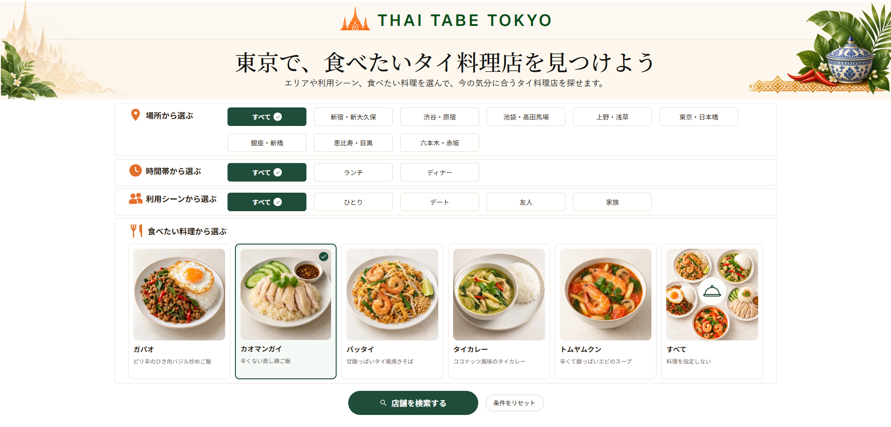
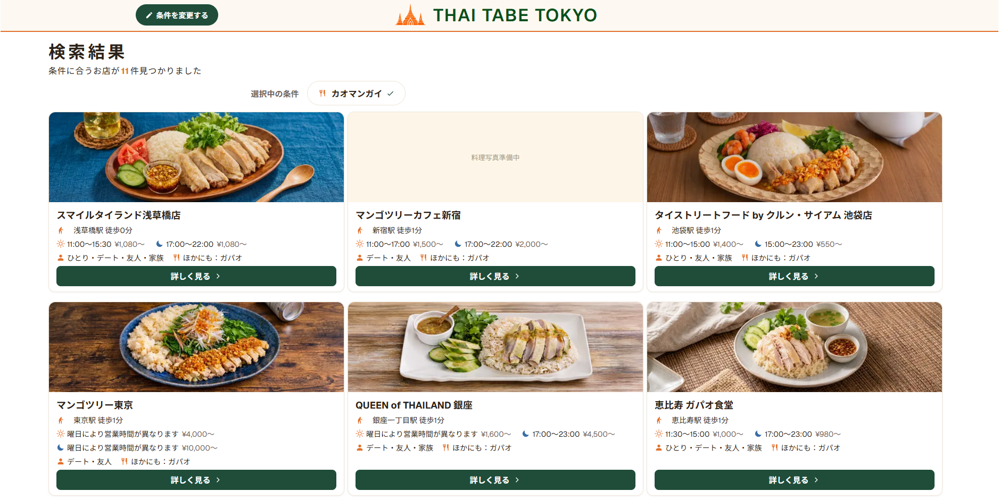
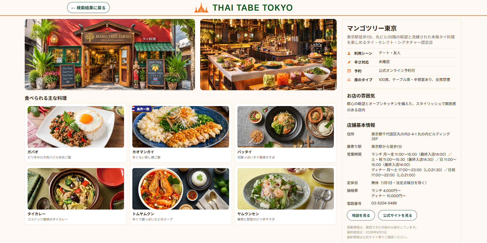

# THAI TABE TOKYO

タイ料理初心者でも、写真を見ながら直感的にお店を探せるWebアプリです。

東京のタイ料理店を、エリア・時間帯・利用シーン・料理から検索できます。

## 公開URL

https://thai-tabe-tokyo.vercel.app

## スクリーンショット

### U01：検索条件選択

エリア・時間帯・利用シーン・料理を選択して検索できます。
料理写真を見ながら、タイ料理初心者でも直感的に選べるようにしています。



### U02：検索結果

選択した条件に合う店舗を一覧で確認できます。
店舗写真・料理写真・徒歩時間などを見ながら比較できます。



### U03：店舗詳細

店舗の外観・店内・料理写真と、営業時間やアクセスなどの詳細情報を確認できます。



## Overview

THAI TABE TOKYOは、東京でタイ料理を楽しみたい人が、
希望する条件から自分に合ったお店を探せるWebアプリです。

料理写真や店舗写真を見ながらお店や料理をイメージできるため、
タイ料理に詳しくない方でも直感的に検索できます。

「タイ料理を食べたいけれど、料理名やお店をよく知らない」
という方でも、写真や条件を手がかりに、
気になるお店を見つけやすくすることを目的に作成しました。

## 主な機能（Features）

### U01：検索条件選択
- エリアから選択
- 時間帯から選択
- 利用シーンから選択
- 料理写真を見ながら食べたい料理を選択
- 複数の条件を組み合わせて店舗を検索

### U02：検索結果
- 条件に合う店舗を一覧表示
- 店舗写真・料理写真を表示
- 最寄り駅・徒歩時間・営業時間・価格帯を確認
- 利用シーンや主な料理を確認
- 店舗詳細画面へ遷移

### U03：店舗詳細
- 店舗の外観・店内イメージを表示
- 食べられる主な料理を写真付きで表示
- 営業時間・定休日・価格帯・アクセスなどを表示
- 店舗の雰囲気や利用シーンを確認
- 地図・公式サイトへのリンクを表示

## 使用技術（Technology）

| カテゴリ | 技術 |
| --- | --- |
| フレームワーク | Next.js 16.3.4（App Router） |
| UIライブラリ | React 19.2.8 |
| 言語 | TypeScript 5.9.3 |
| スタイリング | CSS Modules |
| データベース | Supabase（PostgreSQL） |
| 画像ストレージ | Supabase Storage |
| APIクライアント | @supabase/supabase-js 2.116.0 |
| Lint | ESLint 9 |
| デプロイ | Vercel（Tokyo / hnd1） |

## 工夫した点・苦労した点

### タイ料理初心者でも選びやすいUI
料理名だけではイメージしにくい方でも選びやすいように、
料理写真や店舗写真を使い、エリア・時間帯・利用シーン・料理から
直感的に検索できる画面を意識しました。

### PC・スマートフォン両方で使いやすい画面設計
U01（検索条件選択）、U02（検索結果）、U03（店舗詳細）について、
PC・スマートフォンの両方で見やすく、操作しやすいレイアウトになるよう調整しました。

### 画面ごとに見やすい料理写真サイズを調整
U02（検索結果）とU03（店舗詳細）では、料理カードの役割や表示領域が異なるため、
同じ画像サイズでは見づらくなる部分がありました。

検索結果では一覧性を重視し、店舗詳細では料理写真をより分かりやすく見せるなど、
画面ごとに料理カードと写真のサイズを調整しました。

写真が大きすぎても小さすぎても見づらくなるため、
レイアウト全体とのバランスを確認しながら調整する点に苦労しました。

### 本番環境の表示速度を調査・改善
Vercelへ公開後、検索結果画面の表示に約2秒かかる問題がありました。
ブラウザのNetworkとVercel Logsを使って原因を調査したところ、
Vercel FunctionsとSupabaseの実行リージョンが離れていることが分かりました。

Vercel Functionsを東京リージョンへ変更することで、
検索結果画面の処理時間を約1.94秒から約0.38秒まで短縮しました。

## 今後の実装・改善予定

- 人気の検索条件が分かる検索ランキング機能
- 人気店舗ランキング機能
- 人気料理ランキング機能
- 店舗・料理データの拡充
- Supabaseのデータ取得処理の最適化
- UI/UXの継続的な改善
- テストの充実

## 動作環境（Requirements）

| 項目 | バージョン |
| --- | --- |
| Node.js | 24.18.1 |
| npm | 11.16.0 |
| Git | 2.55.0.windows.3 |

ローカル実行には、以下の環境変数が必要です。

- `NEXT_PUBLIC_SUPABASE_URL`
- `NEXT_PUBLIC_SUPABASE_PUBLISHABLE_KEY`

値はREADMEには記載せず、`.env.example` を参考に `.env.local` を作成してください。

## Getting Started

### 1. リポジトリを取得

```bash
git clone https://github.com/kosukehuta-hash/thai-tabe-tokyo.git
cd thai-tabe-tokyo
```

### 2. パッケージをインストール

```bash
npm install
```

### 3. 環境変数を設定

`.env.example` を参考に、プロジェクトルートへ
`.env.local` を作成してください。

必要な環境変数：

```text
NEXT_PUBLIC_SUPABASE_URL=
NEXT_PUBLIC_SUPABASE_PUBLISHABLE_KEY=
```

※ 実際の値は公開しないでください。

### 4. 開発サーバーを起動

```bash
npm run dev
```

ブラウザで以下を開きます。

```text
http://localhost:3000
```

## ディレクトリ構成

```text
thai-tabe-tokyo/
├── src/
│   ├── app/
│   │   ├── search/           # U02：検索結果画面
│   │   ├── store/[storeId]/  # U03：店舗詳細画面
│   │   ├── page.tsx          # U01：検索条件選択（トップページ）
│   │   └── layout.tsx        # 共通レイアウト
│   └── lib/
│       └── supabase.ts       # Supabaseクライアント
├── public/
│   └── images/               # 画像アセット・README用スクリーンショット
├── supabase/
│   ├── migrations/           # DBスキーマ・RLS・Storage設定
│   └── seed/                 # 初期データ
├── docs/                     # 要件仕様書・初期登録データ
├── vercel.json               # Vercelのリージョン設定
└── .env.example              # 環境変数のテンプレート
```

## よく使うコマンド

| コマンド | 説明 |
| --- | --- |
| `npm run dev` | 開発サーバーを起動する |
| `npm run build` | 本番用にアプリをビルドする |
| `npm run start` | ビルド済みアプリを本番モードで起動する |
| `npm run lint` | ESLintでコードをチェックする |

## 開発・GitHub運用

開発は `main` ブランチを直接編集せず、作業内容ごとにブランチを作成して進めています。

基本的な流れ：

1. `main` から作業ブランチを作成
2. 機能追加・修正を実施
3. commit / push
4. GitHubでPull Requestを作成
5. Checksを確認
6. `main` へマージ
7. Vercelで自動デプロイ

ブランチ名は、作業内容に応じて以下のように使い分けています。

- `feature/...`：機能追加
- `fix/...`：修正
- `docs/...`：ドキュメント更新

## 設計資料

- [THAI TABE TOKYO 要件仕様書](docs/THAI_TABE_TOKYO_要件仕様書_Ver1_実装開始版.xlsx)
  - MVP範囲
  - 検索仕様
  - U01・U02・U03の画面仕様
  - DB設計
  - 画面項目・操作イベント
  - 受け入れ条件・テスト仕様
  - 技術構成・非機能要件
  - 開発・公開手順

要件仕様書をもとに、
要件定義 → 設計 → 実装 → テストの流れを意識して開発しています。

## テスト・動作確認

現在、自動テストは未導入です。
以下の方法で品質・動作を確認しています。

- `npm run lint`：ESLintによるコード品質チェック
- `npm run build`：本番ビルドが正常に完了することを確認
- Vercel公開環境でU01 → U02 → U03の一連の画面遷移・操作を手動確認
- PC・スマートフォン向けのレスポンシブ表示を確認
- 公開後にブラウザのNetworkとVercel Logsを使って表示速度を確認

要件仕様書には「受け入れ条件」「テスト仕様」を定義しています。

今後の課題として、自動テストの導入を予定しています。

## 注意事項

本アプリで使用している店舗写真・料理写真は、
ポートフォリオ用に作成したAI生成のイメージ画像です。

実在店舗の実際の写真ではありません。

## デプロイ（Deployment）

本アプリはVercelで公開しています。

- GitHubの`main`ブランチへのマージをきっかけに自動デプロイ
- Vercel Functions：Tokyo（hnd1）
- Supabase：Tokyo（ap-northeast-1）

Vercel FunctionsとSupabaseのリージョンを東京にそろえることで、
本番環境での通信遅延を改善しています。

## Author

[kosukehuta-hash](https://github.com/kosukehuta-hash)
