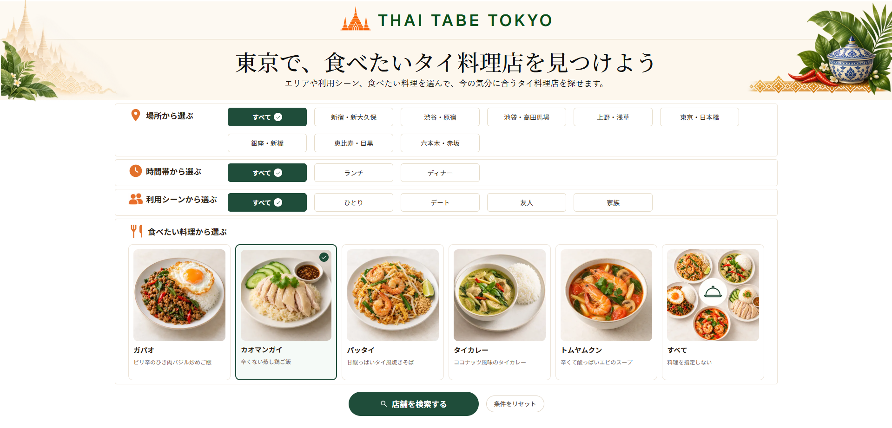
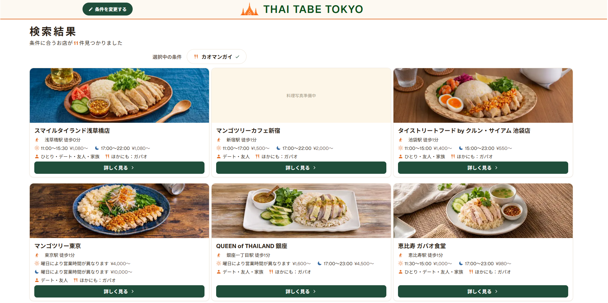
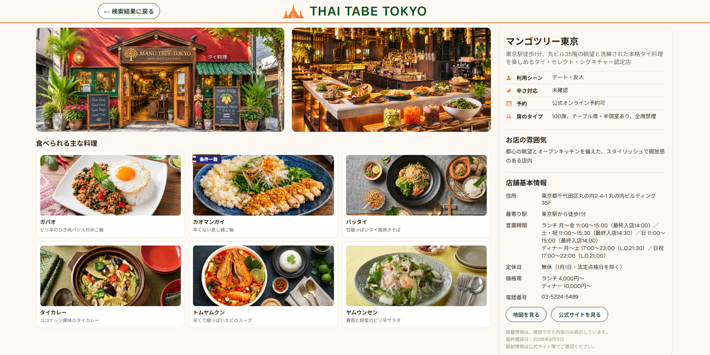
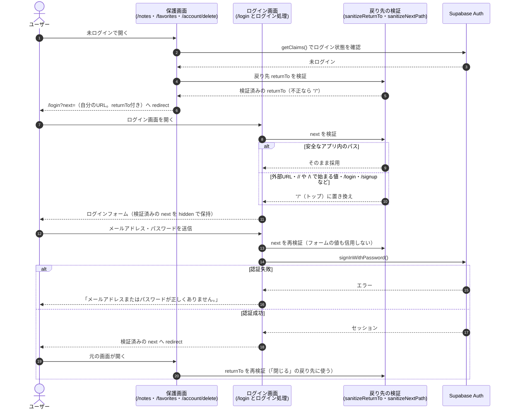
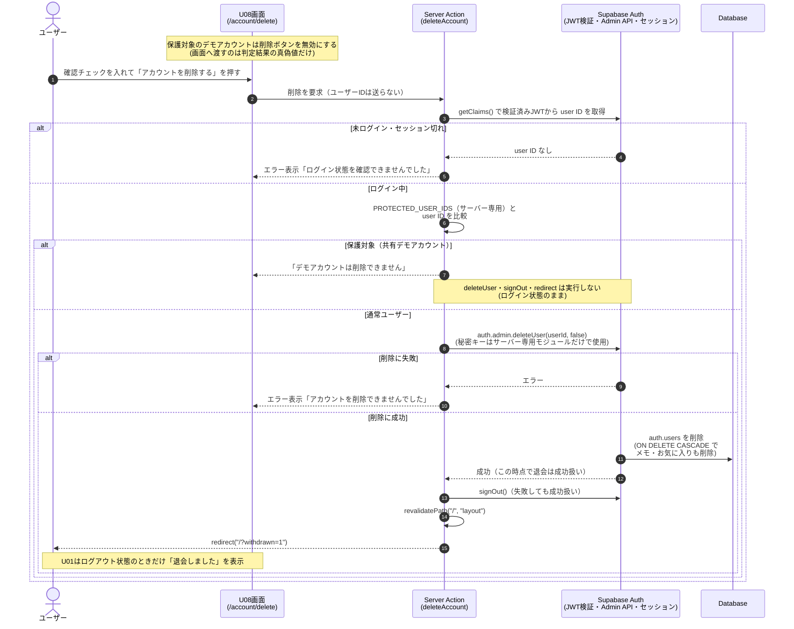

# THAI TABE TOKYO

タイ料理初心者でも、写真を見ながら直感的にお店を探せるWebアプリです。

東京のタイ料理店を、エリア・時間帯・利用シーン・料理から検索できます。

## 公開URL

https://thai-tabe-tokyo.vercel.app

## スクリーンショット

※ 掲載している店舗写真・料理写真はAI生成のイメージ画像です。実在店舗の実際の写真ではありません。

### U01：検索条件選択

エリア・時間帯・利用シーン・料理を選択して検索できます。
料理写真を見ながら、タイ料理初心者でも直感的に選べるようにしています。



### U02：検索結果

選択した条件に合う店舗を一覧で確認できます。
店舗写真・料理写真・徒歩時間などを見ながら比較できます。



### U03：店舗詳細

店舗の外観・店内・料理写真と、営業時間やアクセスなどの詳細情報を確認できます。



## Overview

THAI TABE TOKYOは、東京でタイ料理を楽しみたい人が、
希望する条件から自分に合ったお店を探せるWebアプリです。

料理写真や店舗写真を見ながらお店や料理をイメージできるため、
タイ料理に詳しくない方でも直感的に検索できます。

「タイ料理を食べたいけれど、料理名やお店をよく知らない」
という方でも、写真や条件を手がかりに、
気になるお店を見つけやすくすることを目的に作成しました。

## 主な機能（Features）

### U01：検索条件選択
- エリアから選択
- 時間帯から選択
- 利用シーンから選択
- 料理写真を見ながら食べたい料理を選択
- 複数の条件を組み合わせて店舗を検索

### U02：検索結果
- 条件に合う店舗を一覧表示
- 店舗写真・料理写真を表示
- 最寄り駅・徒歩時間・営業時間・価格帯を確認
- 利用シーンや主な料理を確認
- 店舗詳細画面へ遷移

### U03：店舗詳細
- 店舗の外観・店内イメージを表示
- 食べられる主な料理を写真付きで表示
- 営業時間・定休日・価格帯・アクセスなどを表示
- 店舗の雰囲気や利用シーンを確認
- 地図・公式サイトへのリンクを表示

### 認証（Ver2追加）
- メールアドレスとパスワードでサインアップ
- メールアドレスとパスワードでログイン
- ログアウト
- ヘッダーでログイン状態を表示

### U03：行ったお店のメモ（Ver2追加）
- ログイン中のみ、店舗ごとに「行ったお店のメモ」を登録・更新・削除
- メモは本人のみ閲覧・操作可能（他ユーザーのメモは見えません）

### U06：メモ一覧（Ver2追加）
- 自分が登録したメモを、更新日時の新しい順に一覧表示
- 非公開になった店舗も、店舗名と「非公開」表示を残す
- 非公開店舗は店舗詳細へのリンクを出さない
- 「メモ一覧を閉じる」で、一覧を開く前の画面へ戻る

### U07：お気に入り（Ver2追加）
- 店舗詳細画面からお気に入り登録・解除
- お気に入り一覧で、登録日時の新しい順に表示
- 非公開店舗も一覧には残し、「非公開」と表示
- 非公開店舗は店舗詳細へのリンクを出さない
- 「お気に入りを閉じる」で、一覧を開く前の画面へ戻る

### U08：アカウント削除（Ver2追加）
- 確認チェック後にアカウントを削除
- 削除時に、そのユーザーのメモとお気に入りも削除
- 削除後はトップ画面へ戻り、「退会しました」を表示
- サーバー専用の秘密キーをブラウザへ公開しない構成
- 共有デモアカウントは、削除できないよう保護（「デモアカウントは削除できません」と表示し、削除ボタンは無効）

## 使用技術（Technology）

| カテゴリ | 技術 |
| --- | --- |
| フレームワーク | Next.js 16.3.4（App Router） |
| UIライブラリ | React 19.2.8 |
| 言語 | TypeScript 5.9.3 |
| スタイリング | CSS Modules |
| データベース | Supabase（PostgreSQL） |
| 画像ストレージ | Supabase Storage |
| APIクライアント | @supabase/supabase-js 2.116.0 |
| Lint | ESLint 9 |
| デプロイ | Vercel（Tokyo / hnd1） |

## 工夫した点・苦労した点

### タイ料理初心者でも選びやすいUI
料理名だけではイメージしにくい方でも選びやすいように、
料理写真や店舗写真を使い、エリア・時間帯・利用シーン・料理から
直感的に検索できる画面を意識しました。

### PC・スマートフォン両方で使いやすい画面設計
U01（検索条件選択）、U02（検索結果）、U03（店舗詳細）について、
PC・スマートフォンの両方で見やすく、操作しやすいレイアウトになるよう調整しました。

### 画面ごとに見やすい料理写真サイズを調整
U02（検索結果）とU03（店舗詳細）では、料理カードの役割や表示領域が異なるため、
同じ画像サイズでは見づらくなる部分がありました。

検索結果では一覧性を重視し、店舗詳細では料理写真をより分かりやすく見せるなど、
画面ごとに料理カードと写真のサイズを調整しました。

写真が大きすぎても小さすぎても見づらくなるため、
レイアウト全体とのバランスを確認しながら調整する点に苦労しました。

### 本番環境の表示速度を調査・改善
Vercelへ公開後、検索結果画面の表示に約2秒かかる問題がありました。
ブラウザのNetworkとVercel Logsを使って原因を調査したところ、
Vercel FunctionsとSupabaseの実行リージョンが離れていることが分かりました。

Vercel Functionsを東京リージョンへ変更することで、
検索結果画面の処理時間を約1.94秒から約0.38秒まで短縮しました。

## 主要処理のシーケンス

認証まわりで特に作り込んだ、次の2つの処理の流れです（実装の処理順に沿っています）。

### ログインと戻り先の検証

ログイン後の遷移先（`next`）や、メモ一覧・お気に入り・アカウント削除の「閉じる」の戻り先（`returnTo`）はURLで受け渡すため、書き換えられる可能性があります。検証せずに移動すると、外部サイトへ誘導される「オープンリダイレクト」になるため、サーバー側で検証し、不正な値は安全な既定の画面（トップ `/`）に置き換えます。


```mermaid
sequenceDiagram
    autonumber
    actor U as ユーザー
    participant P as 保護画面<br/>(/notes・/favorites・/account/delete)
    participant L as ログイン画面<br/>(/login とログイン処理)
    participant V as 戻り先の検証<br/>(sanitizeReturnTo・sanitizeNextPath)
    participant A as Supabase Auth

    U->>P: 未ログインで開く
    P->>A: getClaims() でログイン状態を確認
    A-->>P: 未ログイン
    P->>V: 戻り先 returnTo を検証
    V-->>P: 検証済みの returnTo（不正なら "/"）
    P-->>U: /login?next=（自分のURL。returnTo付き）へ redirect
    U->>L: ログイン画面を開く
    L->>V: next を検証
    alt 安全なアプリ内のパス
        V-->>L: そのまま採用
    else 外部URL・// や /\ で始まる値・/login・/signup など
        V-->>L: "/"（トップ）に置き換え
    end
    L-->>U: ログインフォーム（検証済みの next を hidden で保持）
    U->>L: メールアドレス・パスワードを送信
    L->>V: next を再検証（フォームの値も信用しない）
    L->>A: signInWithPassword()
    alt 認証失敗
        A-->>L: エラー
        L-->>U: 「メールアドレスまたはパスワードが正しくありません。」
    else 認証成功
        A-->>L: セッション
        L-->>U: 検証済みの next へ redirect
        U->>P: 元の画面が開く
        P->>V: returnTo を再検証（「閉じる」の戻り先に使う）
    end
```

- `next`（`sanitizeNextPath`）は、アプリ内のパスだけを許可します。外部URL・`//` や `/\` で始まる値・制御文字・`/login` と `/signup`（ログインの繰り返しを防ぐため）は、`/` に置き換えます。
- `returnTo`（`sanitizeReturnTo`）は、上の検証に加えて、U01（`/`）・U02（`/search`）・U03（`/store/数字`）のパスだけを許可します。
- 検証は、ログイン画面とログイン処理（Server Action）の両方で行い、フォームから送られた値も信用しません。

### アカウント削除

アカウント削除は元に戻せないため、画面の制御だけに頼らず、Server Action（サーバー側）でも同じ判定を行います。共有デモアカウントは、環境変数 `PROTECTED_USER_IDS`（サーバー専用）で保護しています。


```mermaid
sequenceDiagram
    autonumber
    actor U as ユーザー
    participant F as U08画面<br/>(/account/delete)
    participant S as Server Action<br/>(deleteAccount)
    participant A as Supabase Auth<br/>(JWT検証・Admin API・セッション)
    participant D as Database

    Note over F: 保護対象のデモアカウントは削除ボタンを無効にする<br/>(画面へ渡すのは判定結果の真偽値だけ)
    U->>F: 確認チェックを入れて「アカウントを削除する」を押す
    F->>S: 削除を要求（ユーザーIDは送らない）
    S->>A: getClaims() で検証済みJWTから user ID を取得
    alt 未ログイン・セッション切れ
        A-->>S: user ID なし
        S-->>F: エラー表示「ログイン状態を確認できませんでした」
    else ログイン中
        S->>S: PROTECTED_USER_IDS（サーバー専用）と<br/>user ID を比較
        alt 保護対象（共有デモアカウント）
            S-->>F: 「デモアカウントは削除できません」
            Note over S,A: deleteUser・signOut・redirect は実行しない<br/>(ログイン状態のまま)
        else 通常ユーザー
            S->>A: auth.admin.deleteUser(userId, false)<br/>(秘密キーはサーバー専用モジュールだけで使用)
            alt 削除に失敗
                A-->>S: エラー
                S-->>F: エラー表示「アカウントを削除できませんでした」
            else 削除に成功
                A->>D: auth.users を削除<br/>(ON DELETE CASCADE で<br/>メモ・お気に入りも削除)
                A-->>S: 成功（この時点で退会は成功扱い）
                S->>A: signOut()（失敗しても成功扱い）
                S->>S: revalidatePath("/", "layout")
                S-->>U: redirect("/?withdrawn=1")
                Note over U,F: U01はログアウト状態のときだけ「退会しました」を表示
            end
        end
    end
```

- 削除する対象のIDは、検証済みのJWT（`getClaims()`）から取得した本人のIDだけです。フォームやURLのIDは受け取りません。
- 保護対象かどうかの判定（`PROTECTED_USER_IDS` との完全一致）は、画面を経由しない直接の実行でも働くよう、Server Action でも行います。保護対象のIDの実値は、画面・ログに出しません。
- 秘密キー（`SUPABASE_SECRET_KEY`）は、サーバー専用のモジュール1か所だけで使い、使う管理APIは `auth.admin.deleteUser()` だけです。ブラウザには渡しません。
- メモとお気に入りは、データベースの外部キー（`ON DELETE CASCADE`）で、ユーザーの削除と同時に削除されます。

## 今後の実装・改善予定

- 人気の検索条件が分かる検索ランキング機能
- 人気店舗ランキング機能
- 人気料理ランキング機能
- 店舗・料理データの拡充
- Supabaseのデータ取得処理の最適化
- UI/UXの継続的な改善

## 動作環境（Requirements）

| 項目 | バージョン |
| --- | --- |
| Node.js | 24.18.1 |
| npm | 11.16.0 |
| Git | 2.55.0.windows.3 |

ローカル実行には、以下の環境変数が必要です。

- `NEXT_PUBLIC_SUPABASE_URL`
- `NEXT_PUBLIC_SUPABASE_PUBLISHABLE_KEY`
- `SUPABASE_SECRET_KEY`（サーバー専用。アカウント削除にのみ使用。下記参照）
- `PROTECTED_USER_IDS`（サーバー専用。共有デモアカウントの削除保護に使用。下記参照）

`SUPABASE_SECRET_KEY` は管理者権限を持つ秘密キーです。**アカウント削除機能（`/account/delete`）のサーバー側処理でだけ使用**し、ブラウザには公開しません（`NEXT_PUBLIC_` を付けません）。本番では、実値をVercelのEnvironment Variablesへ登録します（`.env.local` や `.env.example` に本番の値を書かないでください）。アカウント削除を使わない場合は、他の機能の動作には影響しません。

`PROTECTED_USER_IDS` は、共有デモアカウントを「アカウント削除」（U08）から削除されないよう保護するための、サーバー専用の環境変数です（`NEXT_PUBLIC_` を付けず、ブラウザには公開しません）。保護するユーザーのIDを、カンマ区切りで複数指定できます（各値の前後の空白は無視し、大文字小文字は変換せず、ユーザーIDと完全一致で比較します。部分一致はしません）。未設定または空の場合は、保護対象なしとして扱います。実際のUUIDはREADMEには記載しません。`.env.example` には名前だけを記載し、値は空にしています。本番では、Vercel の Production の Environment Variables へ設定します。

値はREADMEには記載せず、`.env.example` を参考に `.env.local` を作成してください。

## Getting Started

### 1. リポジトリを取得

```bash
git clone https://github.com/kosukehuta-hash/thai-tabe-tokyo.git
cd thai-tabe-tokyo
```

### 2. パッケージをインストール

```bash
npm install
```

### 3. 環境変数を設定

`.env.example` を参考に、プロジェクトルートへ
`.env.local` を作成してください。

必要な環境変数：

```text
NEXT_PUBLIC_SUPABASE_URL=
NEXT_PUBLIC_SUPABASE_PUBLISHABLE_KEY=
SUPABASE_SECRET_KEY=
PROTECTED_USER_IDS=
```

※ 実際の値は公開しないでください。
※ `SUPABASE_SECRET_KEY` はサーバー専用で、アカウント削除にのみ使用します。ブラウザに公開される変数ではありません。
※ `PROTECTED_USER_IDS` はサーバー専用で、共有デモアカウントの削除保護にだけ使用します。ローカルで設定しない場合は、保護対象なしとして動作します。

### 4. 開発サーバーを起動

```bash
npm run dev
```

ブラウザで以下を開きます。

```text
http://localhost:3000
```

## Supabaseのマイグレーション・seed適用（ローカル開発）

Supabaseのデータベース構造（migration）と、動作確認用の最小データ（seed）を、**ローカルDocker環境に再現・検証する手順**です。Next.jsアプリ全体をローカルSupabaseで動かす手順ではありません（アプリの接続先については後述の「Next.jsアプリの接続先について」を参照してください）。

Node.js・npmのバージョンは「動作環境（Requirements）」を、`.env.local`の設定は「Getting Started」の「3. 環境変数を設定」を参照してください。

### 前提条件

- Docker Desktop（ローカルSupabase環境の起動に使用）
- Supabase CLI
- Node.js / npm（「動作環境（Requirements）」参照）
- `.env.local` の設定（「Getting Started」の「3. 環境変数を設定」参照）

### ローカルSupabase環境の起動

プロジェクトルートで以下を実行します。

```bash
supabase start
```

このコマンドにより、

1. `supabase/migrations/` 配下のmigrationファイルがタイムスタンプ順（ファイル名順）にすべて適用され、テーブル・RLS・Storage設定などのDB構造が作成されます
2. 続けて `supabase/seed.sql` が実行され、動作確認用の初期データが投入されます

### seedデータについて

`supabase/seed.sql` は本番データの複製ではなく、U01（検索条件選択）〜U03（店舗詳細）の基本的な画面遷移・検索動作を確認するための最小限のデータです。

| テーブル | 件数 |
| --- | --- |
| areas | 8件 |
| dishes | 6件 |
| stores | 5件 |
| store_dishes | 21件 |
| store_photos | 0件 |
| store_visit_notes | 0件 |

- Authユーザー・Storage画像は含みません
- 動作確認できるよう、店舗5件は `is_published = true` としています
- 本番Supabase Storageへの依存を避けるため、`dishes.search_image_url` はNULLにしています
- 店舗写真（`store_photos`）は投入していませんが、写真が無い場合はアプリ側に「写真準備中」の表示が用意されているため、U02・U03の画面確認に支障はありません

### DBを初期状態へ戻す

```bash
supabase db reset
```

ローカルDBを作り直し、migration → seedを再適用します。

### 型定義（TypeScript）の再生成

Supabaseのテーブル・カラムなど、DBスキーマを変更した場合は、以下のコマンドで型定義を再生成してください。

```bash
npm run db:types
```

ローカルSupabase（`supabase start`で起動したもの）の現在のスキーマから、`src/types/database.types.ts` が最新の内容に再生成されます。

### ローカルSupabaseの停止

```bash
supabase stop
```

### Next.jsアプリの接続先について

- `supabase start` はローカルSupabase環境を起動するコマンドであり、**Next.jsアプリの接続先を自動的に変更するものではありません**
- Next.jsアプリの接続先は、`.env.local` の `NEXT_PUBLIC_SUPABASE_URL` ・ `NEXT_PUBLIC_SUPABASE_PUBLISHABLE_KEY` によって決まります
- 現在これらの環境変数がホスティング済みSupabaseを指している場合、`supabase start` を実行した後も、アプリは引き続きそのホスティング済みSupabaseへ接続します

（参考）ローカルSupabaseを実際にアプリから利用したい場合は、

1. `supabase status` でローカルのAPI URLとPublishable Keyを確認する
2. `.env.local` の上記2つの環境変数をローカル用の値へ変更する
3. Next.js開発サーバーを再起動する

という切り替えが必要です。本章の主目的はmigration・seedの検証であり、この切り替えは必須ではありません。

### 既知の制限（ローカルSupabaseへ接続先を切り替えた場合）

- 現在の `next.config.ts` は、Supabase Storageの画像を `https` 前提で許可しています
- ローカルSupabaseは `http` で起動するため、接続先をローカルに切り替えた場合、Storage画像は現状のコードのままでは表示できません
- `supabase/seed.sql` 自体にもStorage画像は含めていません（本章の手順はDBデータの再現のみを対象としています）

### トラブルシューティング：ポート競合

`supabase start` は `supabase/config.toml` に設定されたポート（デフォルトで`54321`番台）を使用します。別のSupabaseローカルプロジェクトが同時に起動している場合、ポートが競合して起動に失敗することがあります。その場合は `supabase/config.toml` 内の該当ポート番号を、未使用のポートへ一時的に変更してください。

### ホスティング済みSupabaseプロジェクトへの適用について

新規のホスティング済みSupabaseプロジェクトへ適用する場合は、Supabase CLIでプロジェクトをlinkした上でmigration/seedを適用できます。既存データのあるプロジェクトにはseed.sqlを再実行しないでください。

※ ホスティング済みプロジェクトへの適用手順は、本READMEでは動作検証を行っていません。検証済みなのはローカルDocker環境（`supabase start`／`supabase db reset`）での動作のみです。

### seed.sqlに関する注意事項

- `supabase/seed.sql` は、新規・空のデータベースへの初回投入を前提としています
- 同じDBに対して繰り返し実行すると、unique制約違反により失敗する可能性があります
- 本番DBへのseed投入を目的としたものではありません

## デモアカウント（レビュー用）

認証機能・店舗メモ機能・メモ一覧・お気に入りをお試しいただくためのレビュー専用共有アカウントです。
個人を特定する情報は登録していません。

※レビュー用の共通アカウントです。パスワードの変更や、アカウント削除（U08）は行わないでください。

共有デモアカウントは、U08（アカウント削除）から削除できないよう保護しています。保護対象のアカウントでは、U08に「デモアカウントは削除できません」と表示され、「アカウントを削除する」ボタンは無効になります（確認チェックボックスは操作できます）。サーバー側でも保護対象かどうかを判定し、削除処理は実行されません。

| 項目 | 値 |
| --- | --- |
| メールアドレス | thai-tabe-demo@example.com |
| パスワード | ThaiTabeDemo!2026 |

### 確認手順

1. [公開URL](https://thai-tabe-tokyo.vercel.app) にアクセスする
2. ヘッダーの「ログイン」から上記アカウントでログインする
3. 任意の店舗のU03（店舗詳細）画面を開く
4. 「行ったお店のメモ」欄にメモを入力し、「メモを登録」で保存する
5. ページを再読み込みし、登録したメモが表示されることを確認する
6. メモを編集し、「メモを更新」で保存内容が更新されることを確認する
7. 「メモを削除」を押し、確認ダイアログでOKを選ぶとメモが削除され、未登録状態に戻ることを確認する
8. ヘッダーの「メモ一覧」を開き、登録したメモが更新日時の新しい順に表示されることを確認する（「メモ一覧を閉じる」で元の画面へ戻れる）
9. 店舗詳細（U03）の「♡ お気に入り」を押して登録し、ヘッダーの「お気に入り」を開いて、登録した店舗が一覧に表示されることを確認する（「お気に入りを閉じる」で元の画面へ戻れる）
10. お気に入り一覧の「解除」を押すと、お気に入りから外れることを確認する
11. ヘッダーの「ログアウト」でログアウトする

## ディレクトリ構成

```text
thai-tabe-tokyo/
├── src/
│   ├── app/                  # 画面（Next.js App Router）
│   │   ├── page.tsx          # U01：検索条件選択（トップページ）
│   │   ├── search/           # U02：検索結果画面
│   │   ├── store/[storeId]/  # U03：店舗詳細画面（店舗メモ・お気に入りの登録）
│   │   ├── login/            # U04：ログイン
│   │   ├── signup/           # U05：サインアップ
│   │   ├── logout/           # ログアウト
│   │   ├── notes/            # U06：メモ一覧
│   │   ├── favorites/        # U07：お気に入り一覧
│   │   ├── account/delete/   # U08：アカウント削除
│   │   └── layout.tsx        # 共通レイアウト
│   ├── components/           # 共通コンポーネント（認証表示、一覧画面の枠、お気に入りボタンなど）
│   ├── lib/
│   │   ├── queries/          # Supabaseからのデータ取得（検索・店舗・メモ・お気に入りなど）
│   │   ├── supabase/         # Supabaseクライアント（ブラウザ用・サーバー用・proxy用・アカウント削除用）
│   │   ├── supabase.ts       # 公開データ取得用のSupabaseクライアント
│   │   ├── format.ts         # 価格・営業時間・日時（日本時間）の表示整形
│   │   ├── protected-users.ts # 共有デモアカウントの削除保護（保護対象ユーザーの判定）
│   │   └── return-to.ts      # 一覧画面を閉じたときの戻り先の制御
│   ├── proxy.ts              # 認証セッションの更新（Next.js 16のproxy）
│   └── types/                # Supabaseの型定義（自動生成）
├── e2e/                      # Playwrightによる画面テスト
├── scripts/                  # CI・PR管理用のスクリプト
├── public/
│   └── images/               # 画像アセット・README用スクリーンショット
├── supabase/
│   ├── migrations/           # DBスキーマ・RLS・Storage設定
│   ├── seed/                 # 初期データ（CSV）
│   └── seed.sql              # ローカル動作確認用の最小seed
├── docs/                     # 要件仕様書・初期登録データ・PR一覧
├── vercel.json               # Vercelのリージョン設定
└── .env.example              # 環境変数のテンプレート
```

## よく使うコマンド

| コマンド | 説明 |
| --- | --- |
| `npm run dev` | 開発サーバーを起動する |
| `npm run build` | 本番用にアプリをビルドする |
| `npm run start` | ビルド済みアプリを本番モードで起動する |
| `npm run lint` | ESLintでコードをチェックする |

## 開発・GitHub運用

開発は `main` ブランチを直接編集せず、作業内容ごとにブランチを作成して進めています。

基本的な流れ：

1. `main` から作業ブランチを作成
2. 機能追加・修正を実施
3. commit / push
4. GitHubでPull Requestを作成
5. Checksを確認
6. `main` へマージ
7. Vercelで自動デプロイ

ブランチ名は、作業内容に応じて以下のように使い分けています。

- `feature/...`：機能追加
- `fix/...`：修正
- `docs/...`：ドキュメント更新

## 設計資料

- [THAI TABE TOKYO 要件仕様書](docs/THAI_TABE_TOKYO_要件仕様書_Ver2_実装開始版.xlsx)
  - MVP範囲（認証・店舗メモ・お気に入り・アカウント削除を含む）
  - 検索仕様
  - U01〜U08の画面仕様（検索・店舗詳細・ログイン・サインアップ・メモ一覧・お気に入り・アカウント削除）
  - DB設計
  - 画面項目・操作イベント
  - 受け入れ条件・テスト仕様
  - 技術構成・非機能要件
  - 開発・公開手順

要件仕様書をもとに、
要件定義 → 設計 → 実装 → テストの流れを意識して開発しています。

## テスト・動作確認

Vitest・Playwright・GitHub Actionsによる自動テストを導入しています。

- `npm run test`：Vitestによる単体テスト
- `npm run test:e2e`：Playwrightによる主要画面（検索・店舗詳細・認証・店舗メモ等）のE2Eテスト
- `npm run lint`：ESLintによるコード品質チェック
- `npm run format:check`：Prettierによるフォーマットチェック
- `npm run typecheck`：TypeScriptの型チェック
- `npm run build`：本番ビルドが正常に完了することを確認
- GitHub Actions（CI）で、PR作成時・mainへのpush時に上記のテスト・チェックを自動実行
- PC・スマートフォン向けのレスポンシブ表示を手動確認
- 公開後にブラウザのNetworkとVercel Logsを使って表示速度を確認

要件仕様書には「受け入れ条件」「テスト仕様」を定義しています。

## 注意事項

本アプリで使用している店舗写真・料理写真は、
ポートフォリオ用に作成したAI生成のイメージ画像です。

実在店舗の実際の写真ではありません。

## デプロイ（Deployment）

本アプリはVercelで公開しています。

- GitHubの`main`ブランチへのマージをきっかけに自動デプロイ
- Vercel Functions：Tokyo（hnd1）
- Supabase：Tokyo（ap-northeast-1）

Vercel FunctionsとSupabaseのリージョンを東京にそろえることで、
本番環境での通信遅延を改善しています。

## Author

[kosukehuta-hash](https://github.com/kosukehuta-hash)
